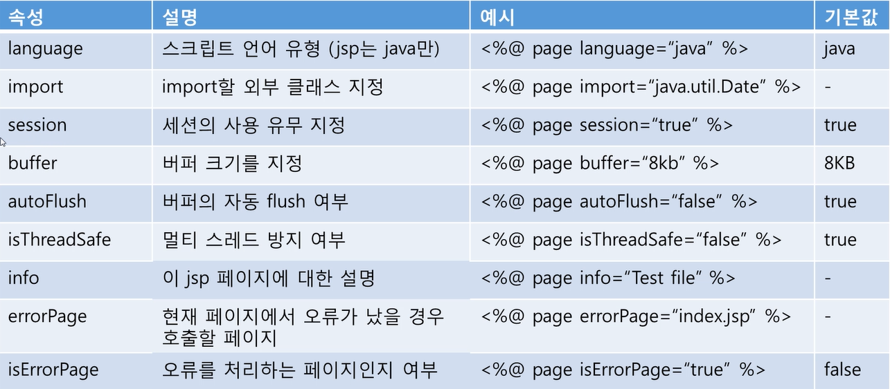

# JSP의 구성 요소
1. ```내용``` : 아무표시가 없으면 HTML로 인식
2. ```<%@ 내용 %>``` : 지시어(directive)
3. ```<%! 내용 %>``` : 선언부(declaration)
4. ```<% 내용 %>``` : 스트립트릿(scriptlet)
5. ```<%= 내용 %>``` : 표현식(expression)
6. ```<%-- 내용 --%>``` : 주석(comment)


## 지시어 (<%@ 내용 %>)
- 해당 페이지의 속성을 기술
  - page : 이 jsp 페이지에 대한 설정 정보 ```<%@page 설정할 내용 %>```
  - include : 다른 jsp 페이지를 이 페이지에 포함 ```<%@include file = "포함할 페이지" %>```
  - taglib : 이 jsp 페이지가 사용할 사용자 정의 태그를 선언 ```<%@taglib 사용자정의태그 선언 %>```
  
   
